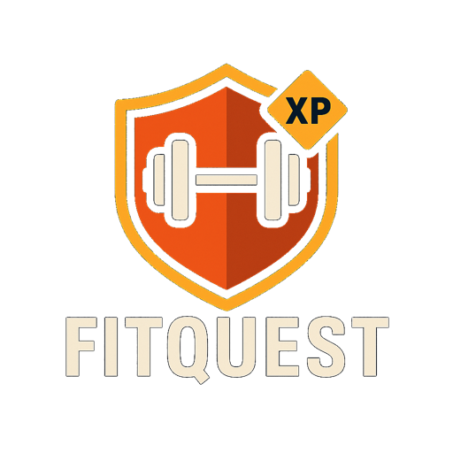
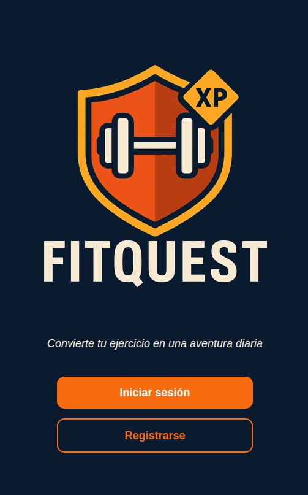
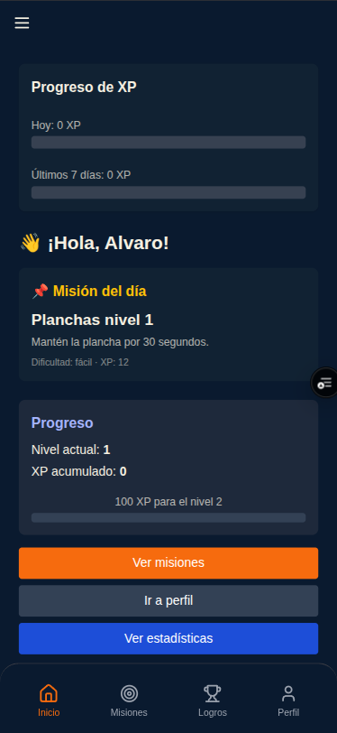
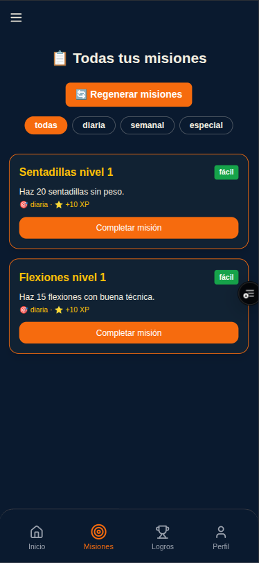
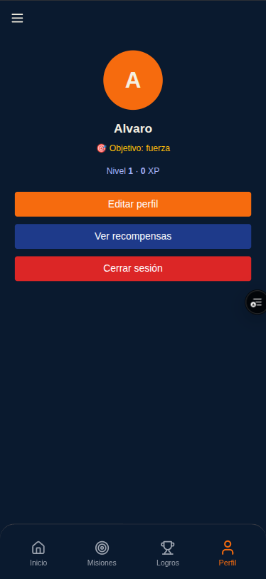
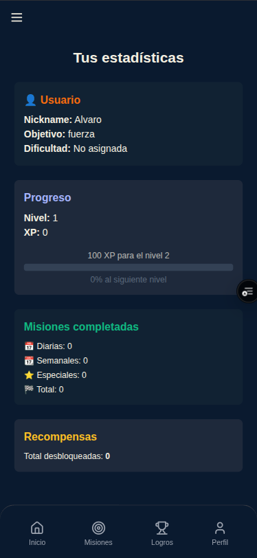
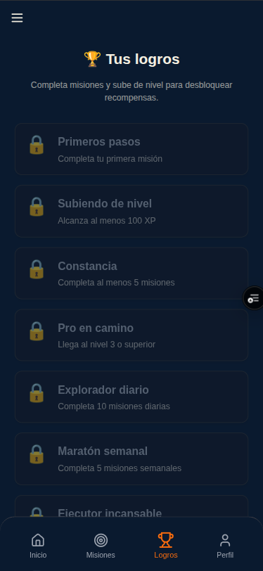
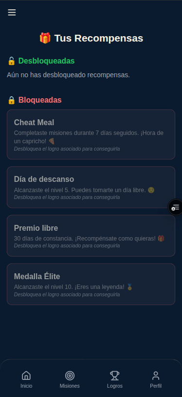

<div align="center">
  
  
  # 🏋️ FITQUEST
  
  ### Transforma tu rutina de ejercicio en una aventura épica
  
  [](https://fitquest-puce.vercel.app)
  [](https://github.com/AlvaroS19/FitQuest)
  [](LICENSE)
  
  **Proyecto Final de Grado Superior en Desarrollo de Aplicaciones Web**  
  Cesur Formación | 2023 - 2025
</div>

---

## 🎯 Sobre el Proyecto

**FITQUEST** es una aplicación web innovadora que combina el fitness con mecánicas de videojuegos RPG. El objetivo principal es resolver uno de los mayores problemas en el mundo del fitness: **la falta de motivación y constancia**.

Muchas personas abandonan sus rutinas de ejercicio porque se sienten repetitivas o aburridas. FITQUEST convierte cada entrenamiento en una experiencia gamificada donde los usuarios:

- 🎮 Ganan **experiencia (XP)** por completar ejercicios
- ⬆️ **Suben de nivel** como en un videojuego
- 🏆 Desbloquean **logros y recompensas**
- 📊 Compiten en **rankings** con otros usuarios
- 🎯 Completan **misiones diarias, semanales y especiales**

El resultado: **un sistema de progresión que hace que el ejercicio físico sea tan adictivo como jugar tu videojuego favorito**.

---

## ✨ Características Principales

### 🎯 Sistema de Misiones
- **Misiones diarias:** Retos cortos que se renuevan cada día
- **Misiones semanales:** Objetivos de mayor dificultad con mejores recompensas
- **Misiones especiales:** Eventos limitados con recompensas exclusivas
- **Regeneración automática:** Las misiones se adaptan al nivel y objetivo del usuario

### 📈 Progresión tipo RPG
- **Sistema de niveles:** Sube de nivel completando misiones y ejercicios
- **Experiencia (XP):** Cada actividad otorga puntos de experiencia
- **Historial de progreso:** Visualiza tu evolución a lo largo del tiempo
- **Estadísticas detalladas:** Gráficos de XP ganada por día/semana

### 🏆 Logros y Recompensas
- **Sistema de logros:** Desbloquea insignias por completar hitos
- **Recompensas por nivel:** Obtén beneficios al subir de nivel
- **Colección de logros:** Visualiza todos tus logros desbloqueados

### 👤 Perfil Personalizado
- **Objetivos fitness:** Configura tu meta (salud, resistencia, tonificación, fuerza)
- **Estadísticas en tiempo real:** Nivel actual, XP, y progreso hasta el siguiente nivel
- **Personalización:** Ajusta tu perfil según tus necesidades

### 🔐 Autenticación Segura
- **Registro con Firebase Auth:** Sistema robusto de autenticación
- **Tokens JWT:** Gestión segura de sesiones
- **Protección de rutas:** Solo usuarios autenticados acceden a sus datos

---

## 📸 Capturas de Pantalla

<div align="center">

### Landing Page


### Dashboard Principal


### Sistema de Misiones


### Perfil de Usuario


### Estadísticas y Progreso


### Logros


### Recompensas


</div>

---

## 🛠️ Stack Tecnológico

### Frontend
- **Vue.js 3** - Framework progresivo con Composition API
- **Vite** - Build tool ultrarrápido
- **Tailwind CSS** - Framework de utilidades CSS
- **Vue Router** - Navegación SPA
- **Pinia** - State management
- **Axios** - Cliente HTTP con interceptores
- **Chart.js** - Gráficos y visualización de datos
- **Lucide Vue** - Iconos modernos

### Backend
- **Node.js** - Entorno de ejecución JavaScript
- **Express.js** - Framework web minimalista
- **Firebase Admin SDK** - Integración con Firebase
- **JWT** - Autenticación basada en tokens
- **bcrypt** - Hash de contraseñas
- **CORS** - Manejo de peticiones cross-origin

### Base de Datos y Autenticación
- **Firebase Firestore** - Base de datos NoSQL en tiempo real
- **Firebase Authentication** - Sistema de autenticación robusto

### Despliegue
- **Vercel** - Hosting del frontend con CI/CD automático
- **Railway** - Hosting del backend con variables de entorno

---

## 🏗️ Arquitectura del Proyecto

```
TFG/
├── frontend/                # Aplicación Vue.js
│   ├── src/
│   │   ├── components/     # Componentes reutilizables
│   │   ├── views/          # Vistas/páginas principales
│   │   ├── services/       # Servicios API y autenticación
│   │   ├── router/         # Configuración de rutas
│   │   ├── stores/         # State management con Pinia
│   │   └── assets/         # Recursos estáticos
│   └── public/             # Archivos públicos
│
├── server/                  # API REST con Node.js
│   ├── controllers/        # Lógica de negocio
│   ├── middlewares/        # Middleware de autenticación
│   ├── routes/             # Definición de rutas
│   ├── services/           # Servicios (Firebase, etc.)
│   └── server.js           # Punto de entrada
│
├── screenshots/            # Capturas de pantalla
└── docs/                   # Documentación adicional
```

---

## 🚀 Instalación y Uso

### Requisitos Previos
- Node.js (v16 o superior)
- npm o yarn
- Cuenta de Firebase configurada

### 1. Clonar el Repositorio
```bash
git clone https://github.com/AlvaroS19/FitQuest.git
cd FitQuest
```

### 2. Configurar Variables de Entorno

**Frontend** (`frontend/.env.local`):
```env
VITE_FIREBASE_API_KEY=tu_api_key
VITE_FIREBASE_AUTH_DOMAIN=tu_dominio.firebaseapp.com
VITE_FIREBASE_PROJECT_ID=tu_project_id
VITE_FIREBASE_STORAGE_BUCKET=tu_bucket
VITE_FIREBASE_MESSAGING_SENDER_ID=tu_sender_id
VITE_FIREBASE_APP_ID=tu_app_id
VITE_API_URL=http://localhost:5000/auth
VITE_API_BASE_URL=http://localhost:5000
```

**Backend** (`server/.env`):
```env
PORT=5000
NODE_ENV=development
FIREBASE_PROJECT_ID=tu_project_id
FIREBASE_CLIENT_EMAIL=tu_client_email
FIREBASE_PRIVATE_KEY=tu_private_key
```

### 3. Instalar Dependencias

**Frontend:**
```bash
cd frontend
npm install
```

**Backend:**
```bash
cd server
npm install
```

### 4. Ejecutar en Desarrollo

**Terminal 1 - Frontend:**
```bash
cd frontend
npm run dev
```

**Terminal 2 - Backend:**
```bash
cd server
npm start
```

El frontend estará disponible en `http://localhost:5173`  
El backend estará disponible en `http://localhost:5000`

---

## 🌐 Demo en Producción

- **🌍 Aplicación:** [https://fitquest-puce.vercel.app](https://fitquest-puce.vercel.app)

### 🔑 Cuenta de prueba

Para probar la aplicación sin necesidad de registrarte:

| Campo | Valor |
|---|---|
| Email | `prueba@fitquest.com` |
| Contraseña | `Prueba1234` |

> Es una cuenta compartida de demostración — sus datos (misiones, XP) pueden cambiar con el uso de otras personas que la prueben.

---

## 📊 Modelo Entidad-Relación

<div align="center">
  
</div>

---

## 🔒 Seguridad y Arquitectura

Además de las funcionalidades principales, el proyecto ha pasado por una revisión de seguridad y arquitectura tras la entrega del TFG:

- **Autenticación centralizada:** toda la gestión del token JWT vive en un único store (Pinia), en vez de repetirse en cada componente
- **CORS restringido:** solo el dominio de producción puede llamar a la API, sin comodines ni orígenes abiertos
- **Sin filtrado de información interna:** los errores del servidor devuelven mensajes genéricos al cliente, sin exponer detalles de Firebase o del stack interno
- **Prevención de enumeración de usuarios:** el login responde igual ante un email inexistente o una contraseña incorrecta
- **Eliminación de código y dependencias muertas:** limpieza de endpoints duplicados, librerías sin uso, y credenciales hardcodeadas
- **Backend desplegado en Render**, con base de datos en Firebase Firestore

---

## 🗺️ Roadmap - Futuras Mejoras

### Producto
- [ ] **Sistema de amigos:** Añadir y desafiar a otros usuarios
- [ ] **Notificaciones push:** Recordatorios de misiones diarias
- [ ] **Desafíos grupales:** Competiciones entre equipos
- [ ] **Sistema de racha:** Días consecutivos completando misiones
- [ ] **Estadísticas avanzadas:** Gráficos más detallados con filtros personalizados
- [ ] **Compartir en redes sociales:** Publicar logros en Instagram/Twitter
- [ ] **Modo claro:** Tema alternativo al oscuro actual
- [ ] **Mejor soporte offline en la PWA**
- [ ] **Integración con wearables** (Fitbit, Apple Watch, Garmin) — exploratorio, sujeto a las políticas de acceso de cada plataforma

### Técnico
- [ ] **Tests automatizados** (unitarios e integración) en frontend y backend
- [ ] **Rate limiting** en los endpoints de login y registro
- [ ] **Migración completa a TypeScript** en el frontend

---

## 🤝 Contribución

Las contribuciones son bienvenidas. Si deseas mejorar FITQUEST:

1. Fork el proyecto
2. Crea una rama para tu feature (`git checkout -b feature/AmazingFeature`)
3. Commit tus cambios (`git commit -m 'Add some AmazingFeature'`)
4. Push a la rama (`git push origin feature/AmazingFeature`)
5. Abre un Pull Request

---

## 📄 Licencia

Este proyecto está bajo la Licencia MIT. Ver el archivo [LICENSE](LICENSE) para más detalles.

---

## 👤 Autor

**Álvaro Delgado Salas**

- 💼 LinkedIn: [linkedin.com/in/alvarodelgado-dev](https://www.linkedin.com/in/alvarodelgado-dev/)
- 📧 Email: alvarodelsalpers@gmail.com
- 🐙 GitHub: [@AlvaroS19](https://github.com/AlvaroS19)
- 📍 Ubicación: Sevilla, España

---

<div align="center">
  
  **⭐ Si te gusta este proyecto, dale una estrella en GitHub ⭐**
  
  Hecho con ❤️ y ☕ por [Álvaro Delgado](https://github.com/AlvaroS19)
  
</div>
